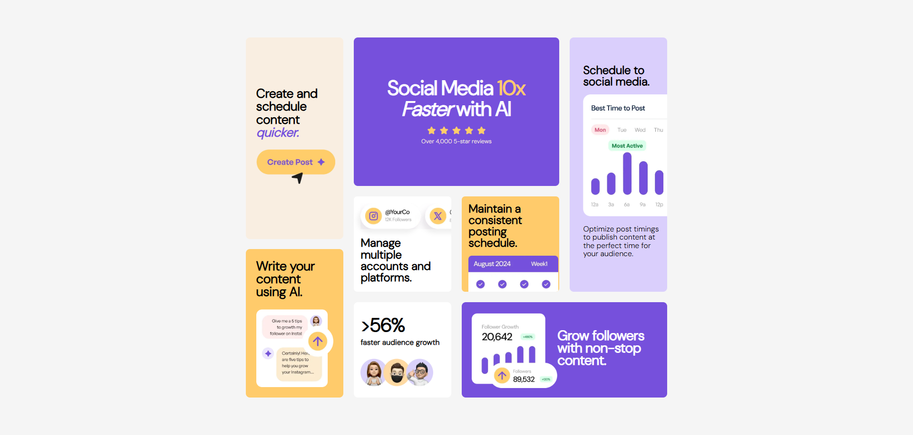

# Frontend Mentor - Bento grid solution

This is a solution to the [Bento grid challenge on Frontend Mentor](https://www.frontendmentor.io/challenges/bento-grid-RMydElrlOj). Frontend Mentor challenges help you improve your coding skills by building realistic projects. 

## Table of contents

- [Overview](#overview)
  - [The challenge](#the-challenge)
  - [Screenshot](#screenshot)
  - [Links](#links)
- [My process](#my-process)
  - [Built with](#built-with)
  - [What I learned](#what-i-learned)
  - [Continued development](#continued-development)
- [Author](#author)
## Overview

### The challenge

Users should be able to:

- View the optimal layout for the interface depending on their device's screen size

### Screenshot

### Links

- Solution URL: [Add solution URL here](https://github.com/AlexanderTejedor/Bento-Grid)
- Live Site URL: [Add live site URL here](https://alexandertejedor.github.io/Bento-Grid/)

## My process

### Built with

- Semantic HTML5 markup
- CSS custom properties
- Flexbox
- CSS Grid
- Mobile-first workflow

### What I learned

I find it very difficult to find the perfect grid system in terms of the number of columns and rows, if you find improvements it is a pleasure to read them.

### Continued development

I would like to continue applying this knowledge to complete future challenges and even future projects.

## Author

- Website - [Alexander Tejedor](https://github.com/AlexanderTejedor)
- Frontend Mentor - [@AlexanderTejedor](https://www.frontendmentor.io/profile/AlexanderTejedor)
- Twitter - [@Alexand59894016](https://x.com/Alexand59894016)
- Instagram - [_.alexDev._](https://www.instagram.com/_.alexdev._/?hl=es)
